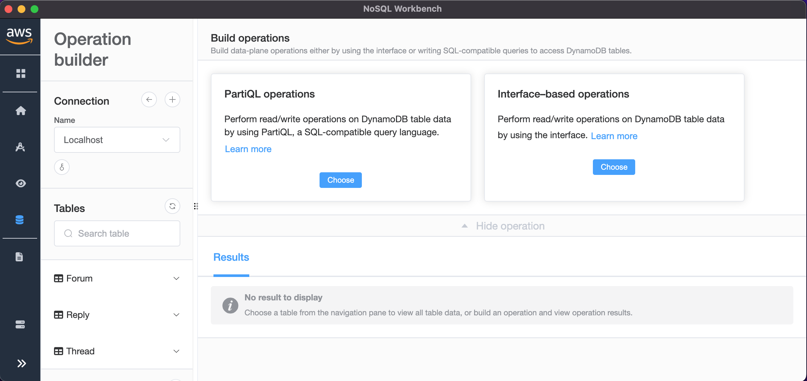
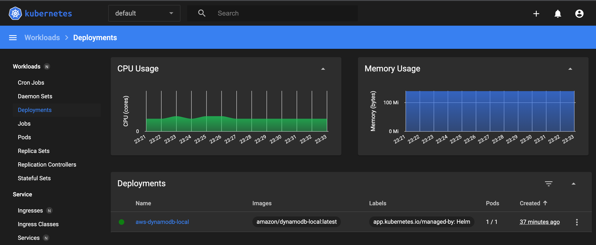

# DynamoDB Local - Kubernetes Setup Steps

## Clone Helm Chart

```
$ cd ~/Workspace
$ git clone github.com/jittakal/dynamodb-local-helm-chart
```

## Install Helm Chart

```
$ helm install aws ./dynamodb-local-helm-chart
$ kubectl port-forward -n default svc/aws-dynamodb-local 8000:8000
```

## Download & Install NoSQL Workbench

```
$ cd tmp
$ wget -o WorkbenchDDBLocal-mac.zip https://s3.amazonaws.com/nosql-workbench/WorkbenchDDBLocal-mac.zip # Only for Mac
```
Refer [Installation Steps](https://docs.aws.amazon.com/amazondynamodb/latest/developerguide/workbench.settingup.install.html)

## Add Localhost Connection

- Go to Operational Builder
- Add Connection for Localhost
-- Host: 127.0.0.1
-- Port: 8000
- Import Sample DynamoDB Tables

Note: DynamoDB Local Running within Kubernetes - Microk8s

## NoSQL Workbench



## DynamoDB Local - K8S


